#### AWS Storage Popular Customers

Example-1 : Drop Box (now they have their own infra)


Example-2 :  Amazon Prime music/videos, Netflix


### Backup and Archival

* _**Backup**_ is meant for recovering quickly from failures, as they are commonly occuring
* _**Archival**_ is meant for recovering from disasters, even when it takes time


* _**Cloud Storage**_ solutions are very popular and cheaper for both backup and archival solutions

### Data Engineering

* Every organization has data, which is used for two purposes :
    * Business Intelligence
    * Machine Learning / AI
* Data in your orgnaization comes from :
    * Databases
    * DataWare houses
    * PDF / WORD / TEXT
    * Images
    * Big Data:
        * Hadoop
        * Spark
* Importing data into cloud in the form of lakes etc.. (_**Cloud Storage infrastructure**_)
* Here we need to understand the cloud storage infra services

#### Object Storage for Streaming / media Solutions

* S3 + Cloudfront (Netflix and Amazon Prime)

#### Block Storage for Virtual Machines

* EBS (_**Elastic Block Storage**_)

#### Units in Storage

* KB vs KiB
* IOPS ( Input / Output operations Per Second)
* Throughput

#### File Shares (Network Storage)

* EFS (Elastic File Share)
* Fsx

### Storage Services by AWS


#### Object Storage

* This is a kind of storage where we can store any file and object, for the users who doesnot have any file system. Access to files in the object storage is done over `http(s)`
* _**S3 (Simple Storage Service)**_ is the object storage - `Storage As A Service`

### AWS Simple Storage Service _**(s3)**_

* S3 has buckets. Each Bucket can have folders or objects
* Individual object cannot be greater than 5 TB of storage
* Let's create an S3 bucket

=> Navigate through s3       


=> Create bucket


=> select Bucket type : General purpose => Give bucket name : qtstoragedemo


 => select Object Ownership : ACLs disabled => Block all public access : unselect


=> select the acknowledge => Bucket Versioning : Disable


=> Encription type : Server-side encryption with Amazon S3 managed keys (SSE-S3) => Bucket key : Enable => Create bucket


=> select the bucket created to insert any content 


=> Upload : select the files need to be uploaded => Upload


=> copy URL


* The URL is `https://qtstoragedemo.s3.amazonaws.com/one.mp4` 

* Price involved in S3 : AWS charges for using `s3` in two dimensions
    * Storage size
    * Access costs
* To adjust Access and Storage costs, aws has `Access Tiers`

1.  _**Standard**_ : accesed frequently
    * Access cost - less
    * Storage cost - high
2. _**Infrequent access**_ :
    * Storage cost - less
    * Access cost - high
3. _**Glacier**_ :
    * Storage cost - very low
    * No access costs
* Now let's understand pricing at high level 

  [ Refer Here : https://calculator.aws/#/ ]

  * Example : Size - 10 TB
    * _**Standard**_ :
        * Storage cost ~= 235 $
        * Access 1000 TB ~= 716 $
    * _**Infrequent**_ :
        * Storage cost ~= 128 $
        * Access 1000 TB ~= 10,240.00
    * _**Glacier**_ :
        * Storage cost ~= 12 $

#### Terms

  * _**Durability**_ : This property defines what is the chance of data not getting corrupted
  * _**Availability**_ : This property defines how much time in an year (calculated in %) is the data available
* Amazon defines `Durability` and `Availability` on the basis of _**Redundancy**_ (copies of the data available)

### Redundancy
    
* By default AWS creates 3 copies of each object and stores them in 3 different zones
* If we select _**`reduced redundancy`**_, then it stores only in one zone
* Create s3 bucket with `ACLs enabled` and ensure `block all public access` is unselected

=> Create bucket


=> Bucket type : General purpose => Bucket name : qtstoragedemoforaccess 


=> Object Ownership : ACLs enabled => Bucket owner preferred 


=> Block all public access : unselected => select acknowledge 


=> Encryption type : Server-side encryption with Amazon S3 managed keys (SSE-S3) => Bucket Key : Enable => Create bucket


* Upload any object into some folder (music)

=> select qtstoragedemoforaccess => Create folder => Folder name : music => Create folder


=> Create folder => Folder name : videos => Create folder


=> select music folder => upload : one.mp3 and two.mp3 => Permissions : Grant public- read access => Upload


=> Properties => select Standard => Upload


=> select the file and copy URL => Check over the browser with the URL


* The URL is `https://qtstoragedemoforaccess.s3.amazonaws.com/music/one.mp3` i.e _**https://(<s3-bucketname).s3.region.amazonaws.com/(<object)**_

=> Try similar for videos upload too


* The URL is `https://qtstoragedemoforaccess.s3.amazonaws.com/videos/two.mp4` i.e _**https://(<s3-bucketname).s3.region.amazonaws.com/(<object)**_

### Storage Classes

1. _**Standard (default)**_ :
  * Frequently accessed
  * high storage cost
  * more redundancy
  * free tier plan (5 GB)
  * most widely used
2. _**Infrequent Access**_ :
  * For older data which is not frequently used
  * Storage cost - less
  * access cost - more
  * Redundancy - more
3. _**One Zone - IA**_ :
  * less durable and infrequent access
4. _**Intelligent Tier**_ : where aws chooses storage class based on usage.

* To change storage class 

=> select the bucket => select object => object actions => Edit storage class => select the storage class => Save changes

[ _**Note**_ : It is difficult to do individually for many number of objects from a bucket ]

* I want to have the object :
    * for the first 30 days in Standard
    * 31-180 days in Onezone – ia
    * 181-1000 days in Glacier
    * 1001 day delete
* For the above mentioned cases, aws has _**Storage lifecycle**_

### Storage Lifecycle

=> select bucket => click on management => Create lifecycle rule


=> Lifecycle rule name : forallcontent => choose rule scope : Apply to all objects in the bucket => select the acknowledge

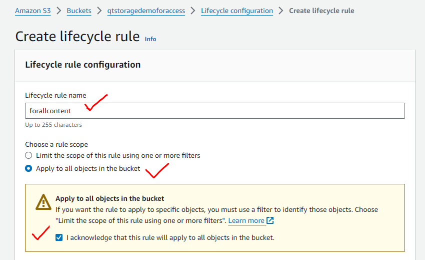

=> Lifecycle rule actions : Move current versions of objects between storage classes => choose storage class transitions : Standard-IA => Days after object creation : 31 => Add transition


=> choose storage class transitions : Glacier Instant Retrieval => Days after object creation : 180 


=> Create rule


*  Create a text file `hello` and upload it into s3-`docs`folder in the bucket with public-access, some content and try accessing it 


* Now change the content and upload the file again


* When we upload the file after changing the content, the older content gets overwritten. If you need to preserve the changes and content, enable _**Versioning**_

=> select bucket => click on Properties => Bucket Versioning => select Edit 


=> Enable => Save changes


=> change the content and upload again 


=> show versions


* AWS supports _**Enable**_ and _**Suspend**_ Versioning

### Static Website Hosting

* S3 uses `https` and it allows to host a static website
* Static website allows :
    * html
    * css
    * javascript
* Let's create a simple webpage with :
    * index.html (`home page`)
    ```
    <h1>Sample Webpage for learning</h1>
    ```
    * error.html (`error page`)
    ```
    <h1>Error occurred</h1>
    <h2>Contact your admin</h2>
    ```
    

* Create a bucket with `ACLs enabled` and grant `public-read only access`

=> Create bucket => Bucket type : General purpose => Bucket name : mywebpage.website => Object Ownership : ACLs enabled => Bucket owner preferred => Block all public access : unselected => select acknowledge => Create bucket


=> select the bucket => click on properties =>  go to Static Website Hosting => Edit 


=> Static website hosting : Enable => Hosting type : Host a static website


=>select the document type => Save changes  


=> copy the URL obtained 


=> Navigate to objects and upload the documents along with public-access


=> Expose over the browser with the URL


* We have added some bootstrap content to `index.html` as below :
```
<head>
    <!-- Latest compiled and minified CSS -->
<link rel="stylesheet" href="https://cdn.jsdelivr.net/npm/bootstrap@3.3.7/dist/css/bootstrap.min.css" integrity="sha384-BVYiiSIFeK1dGmJRAkycuHAHRg32OmUcww7on3RYdg4Va+PmSTsz/K68vbdEjh4u" crossorigin="anonymous">

<!-- Optional theme -->
<link rel="stylesheet" href="https://cdn.jsdelivr.net/npm/bootstrap@3.3.7/dist/css/bootstrap-theme.min.css" integrity="sha384-rHyoN1iRsVXV4nD0JutlnGaslCJuC7uwjduW9SVrLvRYooPp2bWYgmgJQIXwl/Sp" crossorigin="anonymous">

<!-- Latest compiled and minified JavaScript -->
<script src="https://cdn.jsdelivr.net/npm/bootstrap@3.3.7/dist/js/bootstrap.min.js" integrity="sha384-Tc5IQib027qvyjSMfHjOMaLkfuWVxZxUPnCJA7l2mCWNIpG9mGCD8wGNIcPD7Txa" crossorigin="anonymous"></script>
</head>
<body>
    <div class="jumbotron text-center">
        <h1>My First Website</h1>
        <p>Resize this responsive page to see the effect!</p>
      </div>

      <div class="container">
        <div class="row">
          <div class="col-sm-4">
            <h3>AWS</h3>
            <p>Lorem ipsum dolor..</p>
          </div>
          <div class="col-sm-4">
            <h3>DevOps</h3>
            <p>Lorem ipsum dolor..</p>
          </div>
          <div class="col-sm-4">
            <h3>Azure</h3>
            <p>Lorem ipsum dolor..</p>
          </div>
        </div>
      </div>
</body>
```
=> Upload the files to the object and from properties take the URL to check if working


* And We have added some javascript content to `index.html` as below :
```
<!DOCTYPE html>
<html lang="en">
<head>
  <title>Bootstrap Example</title>
  <meta charset="utf-8">
  <meta name="viewport" content="width=device-width, initial-scale=1">
  <link rel="stylesheet" href="https://maxcdn.bootstrapcdn.com/bootstrap/3.4.1/css/bootstrap.min.css">
  <script src="https://ajax.googleapis.com/ajax/libs/jquery/3.6.3/jquery.min.js"></script>
  <script src="https://maxcdn.bootstrapcdn.com/bootstrap/3.4.1/js/bootstrap.min.js"></script>
</head>
<body>

<div class="container">
  <h2>Basic Modal Example</h2>
  <!-- Trigger the modal with a button -->
  <button type="button" class="btn btn-info btn-lg" data-toggle="modal" data-target="#myModal">Open Modal</button>

  <!-- Modal -->
  <div class="modal fade" id="myModal" role="dialog">
    <div class="modal-dialog">

      <!-- Modal content-->
      <div class="modal-content">
        <div class="modal-header">
          <button type="button" class="close" data-dismiss="modal">&times;</button>
          <h4 class="modal-title">Modal Header</h4>
        </div>
        <div class="modal-body">
          <p>Some text in the modal.</p>
        </div>
        <div class="modal-footer">
          <button type="button" class="btn btn-default" data-dismiss="modal">Close</button>
        </div>
      </div>

    </div>
  </div>

</div>

</body>
</html>
```
=> Upload the files to the object and from properties take the URL to check if working


### CDN ( Content Delivery Networks )

* Let's create an s3 bucket with video files and open them in some web page
* AWS has `edge locations` across the world 

  [ Refer Here : https://www.feitsui.com/en/article/3 ]

* To enable CDN, aws has a service called as _**Cloud Front**_
* Let's create a distribution

=> Navigate through Cloud Front => Create Distribution => select Origin domain : qtvideos.learning => Create distribution

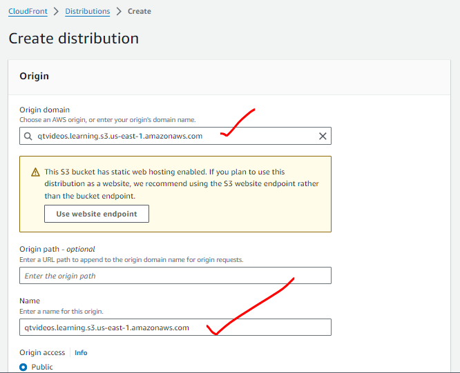


* Replacing the s3 access links for videos to cloudfront names


```
<head></head>
<body>
    <div>
        <video width="320" height="240" controls>
            <source src="https://d3innnak3p96l6.cloudfront.net/one.mp4" type="video/mp4" />
        </video>
        <video width="320" height="240" controls>
            <source src="https://d3innnak3p96l6.cloudfront.net/two.mp4" type="video/mp4" />
        </video>
    </div>
    <div>
        <video width="320" height="240" controls>
            <source src="https://d3innnak3p96l6.cloudfront.net/three.mp4" type="video/mp4" />
        </video>
        <video width="320" height="240" controls>
            <source src="https://d3innnak3p96l6.cloudfront.net/four.mp4" type="video/mp4" />
        </video>
    </div>
</body>
```


#### Replication to other regions

=> select a bucket => click on Mangement => Replication rules => Create replication rules


=> Replication rule name : copyall => Enable bucket versioning


=> Source bucket : select Apply to all objects in the bucket


=> Destination : Browse : qtwebpage.website => Enable bucket versioning


 =>  IAM role : select Create new role 
 

 
=> Save => select yes,replicate existing objects => Submit


=> Generate completion report : choose browser as the destination => Save


=> A job gets created


* Replication rules will create s3 jobs

* In the local system we change as follows :
```
-> aws s3 cp s3://qtvideos.learning s3://mywebpage.website
-> aws s3 cp --recursive s3://qtvideos.learning s3://mywebpage.website
-> aws s3 sync s3://qtvideos.learning s3://mywebpage.website
-> mkdir c:\temp\content
-> cd c:\temp\content
-> aws s3 sync s3://qtvideos.learning .
-> ls
-> cp c:\local sysytem\Downloads\*.mp3
-> ls
-> aws s3 sync . s3://qtvideos.learning 
```
### Using CLI

* AWS S3 supports two cli commands
    * s3
    * s3 api (low level operations)
* AWS CLI has the following syntax :

  `aws <service> <action> [--arg1 value1 --argn valuen]`
* Let's work with CloudShell 


* s3 bucket uri : `s3://<bucket-name>`
* s3 object uri : `s3://<bucket-name>/folder-name/object-name` `s3://qttesting/videos/one.mp4` or `s3://qttesting/one.mp4`
* Open aws s3 cli docs :

    [ Refer Here : https://docs.aws.amazon.com/cli/latest/reference/s3/ ]

* _**ls**_ :
  
  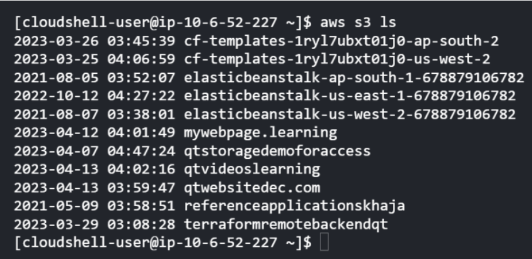
  

* _**mb**_ : create the bucket
    * create a s3 bucket `qts3fromcli`

          

    * In this bucket create two folders :
        * music 
        * videos
    * In the `music` folder upload some files
      ```
      touch one.mp3
      aws s3 cp one.mp3 s3:\\music\one.mp3
      ```
    * In the `videos` folder upload some files
      ```
      touch one.mp4
      aws s3 cp one.mp4 s3:\\videos\one.mp4
      touch two.mp4
      aws s3 cp two.mp4 s3:\\videos\two.mp4
      ```
    * Show the contents
        * of all the buckets
        * of music folder

        

    * Remove the bucket `aws s3 rb --force s3://qts3fromcli`
* To upload a file `aws s3 cp`

#### Example

* Create a bucket with name which has source in it and one more bucket with name which has destination in it.
* Uplod some files in to `Source bucket` (ensure you have folders) and copy the contents into `Destination bucket`
    * copy one file
    * copy all the buckets
        * use sync
        * use recursive copy
    * `mv` move the object in a bucket from one folder to other folder
* Delete all the buckets
* Upload a file into a bucket with `public-read permissions`
* Example
```
echo "Hello" > one.txt
aws s3 ls
aws s3 cp one.txt s3://qtvideos.learning/one.txt --acl public-read
```
* Go to bucket => copy URL => expose over browser

### S3 Bucket Policies

* S3 has a resource based access policy which is referred as s3 bucket policies
* S3 has support of _**ACL (Access Control List)**_ where we can provide basic access levels such as :
  * private
  * public-read
  * public-write

* Let's create a bucket in s3

=> Create bucket => Bucket type : General purpose => Bucket name : qtaccesspolicy => Object Ownership : ACLs disabled => Bucket owner preferred => Block all public access : unselected => select acknowledge => Create bucket


* We can create s3 bucket policies using `Policy generator` 

  [ Refer Here : https://awspolicygen.s3.amazonaws.com/policygen.html ]

* Consider the following bucket policy, which gives accces to all objects from a `specific ip`

=> Copy ARN from bucket


=> Find `my ip` - `117.200.2.183/32` from EC2 or Security groups

* From the _**Policy generator**_

=> Select Type of Policy : S3 Bucket Policy => Effect : Allow => Principal : * => Actions : select All actions => Amazon Resource Name (ARN) : [copied from the bucket] 


=> Add conditions => Condition : IpAddress => Key : aws:SourceIp => Value : 117.200.2.183/32 => Add Statement 


=> Geneate Policy


=> Policy is as follows :

```
{
  "Id": "Policy1714800812093",
  "Version": "2012-10-17",
  "Statement": [
    {
      "Sid": "Stmt1714800733599",
      "Action": "s3:*",
      "Effect": "Allow",
      "Resource": ["arn:aws:s3:::qtaccesspolicy", "arn:aws:s3:::qtaccesspolicy/*"],
      "Condition": {
        "IpAddress": {
          "aws:SourceIp": "117.200.2.183/32"
        }
      },
      "Principal": "*"
    }
  ]
}
```
* Add the policy to S3 bucket

=> select the bucket => click on permissions 


=> Bucket policy => Edit 


=> paste the generated policy 


=> Save changes


* Upload some text / audio / video file into the bucket. Try accessing the ipaddress which gets access to a file


* For others we get access denied
* Let's change the policy to
```
{
  "Id": "Policy1714800812093",
  "Version": "2012-10-17",
  "Statement": [
    {
      "Sid": "Stmt1714800733599",
      "Action": "s3:*",
      "Effect": "Allow",
      "Resource": ["arn:aws:s3:::qtaccesspolicy", "arn:aws:s3:::qtaccesspolicy/*"],
      "Condition": {
        "NotIpAddress": {
          "aws:SourceIp": "117.200.2.183/32"
        }
      },
      "Principal": "*"
    }
  ]
}
```
* Now if we want to give access to specific aws user `qtdevops` ( IAM user with no permissions)
```
{
  "Id": "Policy1714800812093",
  "Version": "2012-10-17",
  "Statement": [
    {
      "Sid": "Stmt1714800733599",
      "Action": "s3:*",
      "Effect": "Allow",
      "Resource": ["arn:aws:s3:::qtaccesspolicy", "arn:aws:s3:::qtaccesspolicy/*"],      
      "Principal": "arn:aws:iam::891376970974:user/qtdevops"
    }
  ]
}
```
* Now if we want to give access to specific aws user `devops` ( IAM user with administration access )
```
{
  "Id": "Policy1714800812093",
  "Version": "2012-10-17",
  "Statement": [
    {
      "Sid": "Stmt1714800733599",
      "Action": "s3:*",
      "Effect": "Allow",
      "Resource": ["arn:aws:s3:::qtaccesspolicy", "arn:aws:s3:::qtaccesspolicy/*"],      
      "Principal": "arn:aws:iam::891376970974:group/devops"
    }
  ]
}
```
* _**Exercise**_ 

Write a bucket policy to give access on all the objects in a bucket
```
{
  "Id": "Policy1714800812093",
  "Version": "2012-10-17",
  "Statement": [
    {
      "Sid": "Stmt1714800733599",
      "Action": "s3:*",
      "Effect": "Allow",
      "Resource": ["arn:aws:s3:::qtaccesspolicy", "arn:aws:s3:::qtaccesspolicy/*"],      
      "Principal": "*"
    }
  ]
}
```
### Overview of Other Storage Types

* _**Virtual Disks**_ : This storage acts as a disk to an ec2 instance. To create Virtual Disks we have two options :
  * Elastic Block Storage (EBS)
  * Instance-Store
* _**Network Disks**_ : To create network disks also we have two options :
  * Elastic File Share (EFS)
  * FsX

* _**EBS/Instance-Storage**_ are disk storages which are used to serve one instance at a time, where as _**EFS/FsX**_ are used to serve multiple machines over a network
* _**Disk Technologies**_
    * Magnetic
    * Hard Disk Drives (HDD)
    * Solid State Drives (SSD)
* Important _**factors of Disk**_
    * Size
    * Speed
* _**Performance of the disks**_ are measured using :
    * IOPS (no.of operations we can perform)
    * Throughput (size)

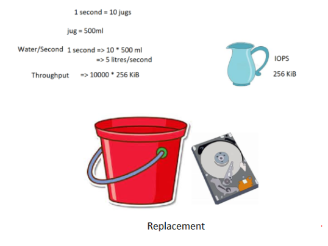

### AWS Disk Storages

#### Amazon Elastic Block Storage

* This is a service that offers a persistent storage for ec2 instances
* EBS has to be _**os disk**_ in aws
* EBS will be from the same zone in a region where ec2 is launched
* EBS is physically located in different server in the same zone where ec2 is launched where as instance store comes from the same physical location
* _**Instance store**_ is supported only by few instance types
* AWS uses a term called as _**Volume**_ to represent disk
* Root volume is disk with os which has to be EBS


* EBS can be attached to only one ec2 instance at any given moment
* Backups of EBS volumes are called as _**Snapshots**_
* Snapshots can be taken manually or AWS Backup service can automatically take backups according to schedules
* _**EBS Volumes types**_

  1. _**General Purpose SSD**_ :
        * IOPS : 100 to 16,000 IOPS
      * good performace at low cost
  2. _**Provisioned IOPS SSD**_ :
        * IOPS : 100 to 100000 iops
        * Size to IOPS ratio has to be between (1:50)
  3. HDD-Backed Volume
  4. Throughput Optimized HDD
  5. ColdHDD

       

* AWS can provide :
    * empty disks to EC2
    * disks from snapshots to EC2
* EC2 disk sizes can be increased, but not decreased (as there is a chance of memory loss)

#### Amazon Elastic File Share

* Fully managed file share which can be mounted to multiple linux instances
* This is storage from network, so it comes with security group
* _**Performance Mode**_ :
    * General Purpose
    * Max I/O Mode
* EFS cannot be mounted as os disk, where as can be mounted on any other disk

### Experiments

* Create two ubuntu ec2 instances in any region

=> Instances => Launch instances => Instance name : sample service => No.of instances : 2 => Configure storage => Advanced


=> Change Volume type : gp2 => Delete on termination : yes => Launch Instance

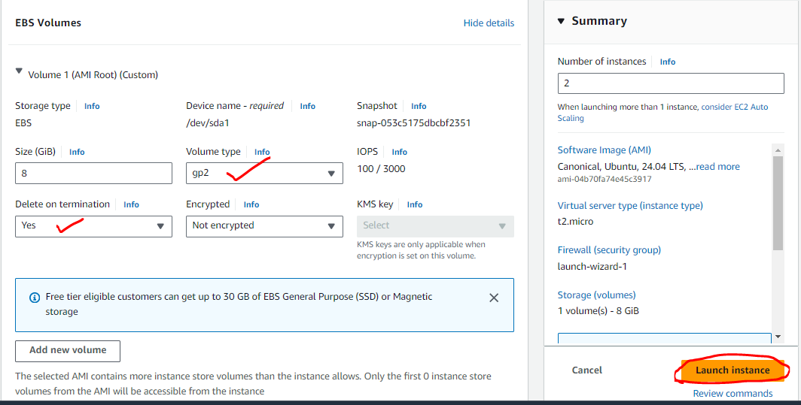

* Make a note of Volumes created

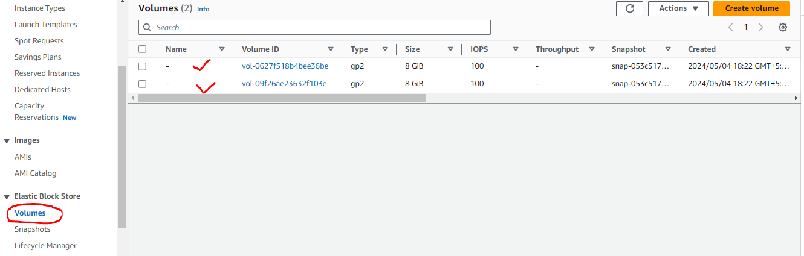

* Create a snapshot of volume

=> select a volume created => Actions => Create snapshot


=> Description : mysnapshot 


=> Create snapshot


* From snapshot create a new volume in different _**AZ ( Availability Zone )**_

=> select the snapshot => Actions : Create volume from snapshot


=> Availability zone : us-east-1a => Create volume

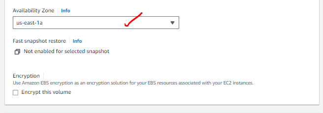
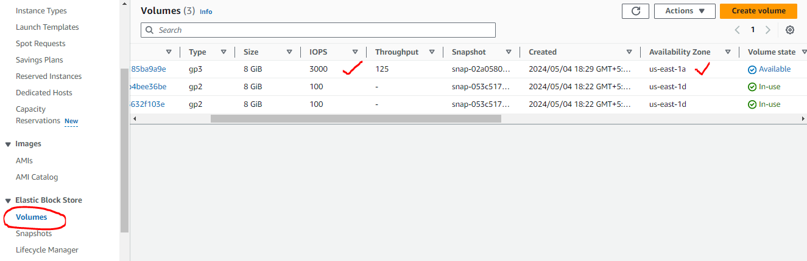

* From snapshot create a new volume in different Region

  * Select Snapshot

  => select a snapshot => Actions => copy snapshot 
  
  

  * Copy snapshot to any region

  => change the region => Copy snapshot 
  
  
  
  * from there create ebs volume

  => go to the selected region => select the snapshot => create volume from snapshot 

   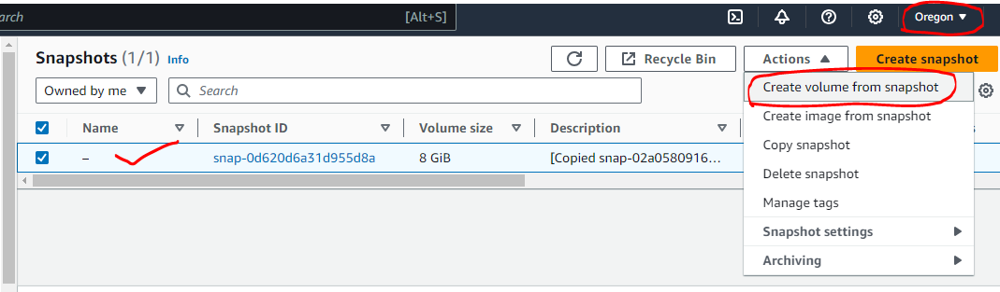
   
   

  => Terminate the machines => delete the volumes => delete the snapshots

### Tasks

* Create an ec2 instance

=> Launch instance => Inastance name : instance => ubuntu => keypair => Security group => 8GB, gp2 type => Launch instance


* Create a new empty volume (Size 1 GB)

=> volumes => Create volume => size : 1GB => Availability zone : same as ec2 => Create volume => name : tools


* Attach the volume to ec2

=> select the volume => Actions : Attach volume => instance : select the running instance => Device name : /dev/sdf => Attach volume


* Mount this to ec2 instance

=> login into the instance => sudo lsblk => 


* Create a xfs based file system

=> sudo mkfs -t xfs /dev/xvdf


* Let's mount this to a folder / tools

=> sudo mkdir /tools => sudo mount -t xfs /dev/xvdf /tools => sudo df -h => sudo lsblk

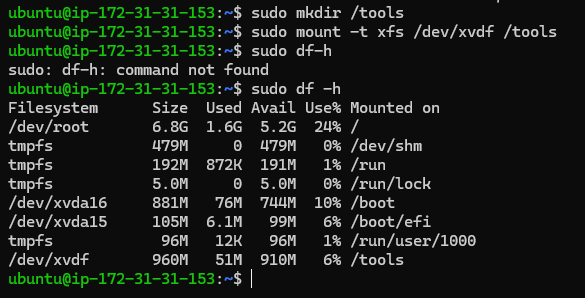


* Restart the machine

=> stop and start the instance => relogin using new ip

* See what are mounts attached

=> sudo lsblk => sudo df -h


* If we need to preserve the mounts we need to deal with _**fstab**_
* Execute `sudo blkid` and make a note of block id info

=> sudo blkid


```
/dev/xvdf: UUID="b897c8e8-7c85-40e7-9e37-f9d14cc3f6b6" BLOCK_SIZE="512" TYPE="xfs"
```
* Add the following info to `/etc/fstab` 

=> sudo vi /etc/fstab


```
UUID=b897c8e8-7c85-40e7-9e37-f9d14cc3f6b6 /tools xfs defaults,nofail 1 2
```


* Let's restart the machine and check mounts

=> stop and start the instance => relogin with the new ip

[ _**Note**_ : When doesn't work let's connect the volume to another running new instance]

* For the instructions :

    [ Refer here : https://learn.microsoft.com/en-us/azure/virtual-machines/linux/attach-disk-portal?tabs=ubuntu#find-the-disk ]

  

### Overview of Disks on Windows and linux


### Elastic File Share

* This is network file share
* Security group exists for EFS
* EFS is a regional resource, where we mention in which zones we want to have mounts. Sync of data across AZ’s is managed by AWS
* EFS works only with linux instances
* Let's create two ec2 instances in different zones

=> Launch instances => name : ubuntu-1a => ubuntu => instance type : t2.micro => keypair : PubKey => Network settings : subnet- us-east-1a => Security group => launch instance

=> Launch instances => name : amazon-linux-1b => amazon linux 2 - volume type => instance type : t2.micro => keypair : PubKey => Network settings : subnet- us-east-1b => Security group => launch instance

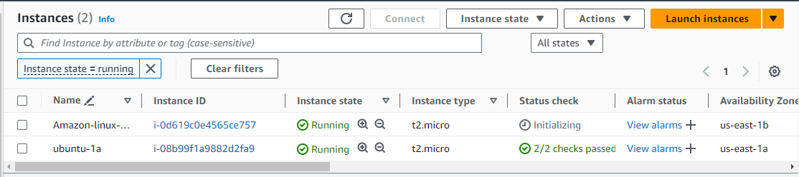

* Create a efs file share

=> Navigate through EFS => Create file system 


=> name : tools => VPC : default => Customize 


=> select Enable automatic backups 


=> Next => Mount Targets : 1d => Security group => Mount Targets : 1e => Security groups => Next

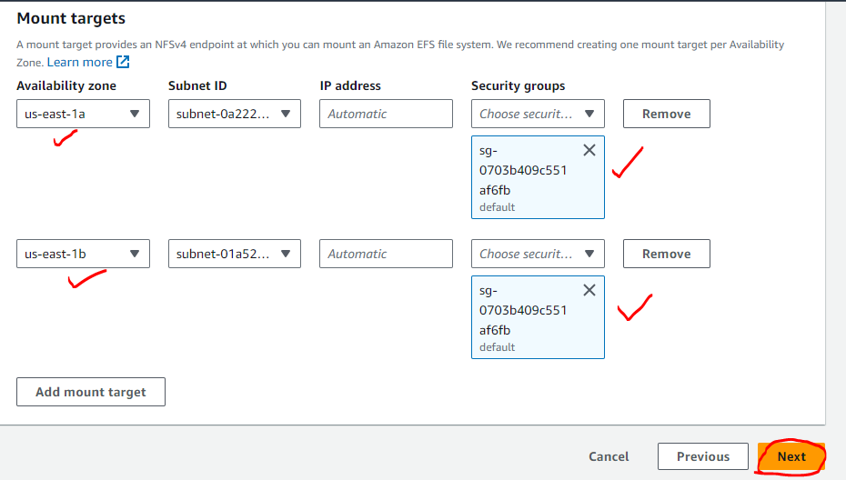

=> Next => Create

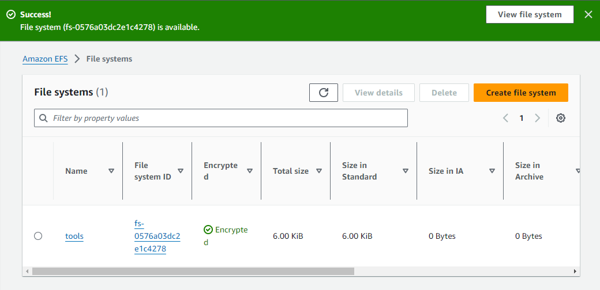

* Now view details

=> DNS name (Disk location) => Attach

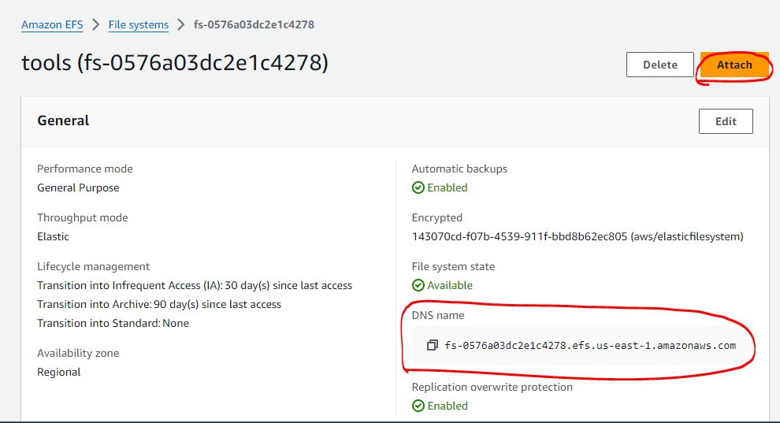


* Mounting using efs mount helper 

    [ Refer Here : https://docs.aws.amazon.com/efs/latest/ug/efs-mount-helper.html ]

* Installation instructions for linux 

    [ Refer Here : https://docs.aws.amazon.com/efs/latest/ug/mounting-fs-mount-helper-ec2-linux.html ]

* Mount ec2 instance and create files

=> login to the zone 1b (Amazon linux) machine `ssh ec2-user@ip-address`

```
sudo yum update
sudo mkdir /tools
sudo yum install -y amazon-efs-utils
sudo mount -t efs -o tls fs-090da91157fcf8ec9:/ /tools
sudo df -h
sudo touch /tools/{1..10}.txt
ls /tools/
```

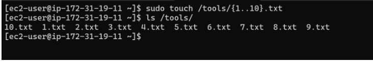

=> login to the zone 1a (Ubuntu) machine `ssh ubuntu@ip-address`

```
sudo apt-get update
sudo apt-get -y install git binutils
git clone https://github.com/aws/efs-utils
cd efs-utils
./build-deb.sh
sudo apt-get -y install ./build/amazon-efs-utils*deb
sudo mkdir /networktools
sudo mount -t efs -o tls fs-090da91157fcf8ec9:/ /networktools
sudo df -h
ls /networktools/
```


### AWS FsX

* FSx is an aws Managed service for file shares from third parties
* As of now aws supports :
    * NetAPP
    * Windows File Share
    * ZFS
    * Lustre


### Glacier

* For Glacier Data Models

    [ Refer here : https://docs.aws.amazon.com/amazonglacier/latest/dev/amazon-glacier-data-model.html ]

* Create a vault 

    [ Refer Here : https://docs.aws.amazon.com/amazonglacier/latest/dev/creating-vaults-cli.html ]

* Download and configure `AWS CLI`

=> IAM => create a user => take the access key and security key


* For the glacier cli

    [ Refer here : https://docs.aws.amazon.com/cli/latest/reference/glacier/ ]

* Create a vault

 _**aws glacier create-vault --acount-id (<your-aws-account-id) --vault-name 'qtvault'**_
```
aws glacier create-vault --account-id '891376970974' --vault 'qtvault'
```


* Create a zip file with some content
* Upload the zip file to the vault 

    [ Refer Here : https://docs.aws.amazon.com/amazonglacier/latest/dev/uploading-archive-single-operation.html ]


* If you want to deal with large file by breaking that into multiple parts

    [ Refer here : https://docs.aws.amazon.com/amazonglacier/latest/dev/uploading-an-archive-mpu-using-cli.html ]

* For downloading the archive (during disasters)

    [ Refer here : https://docs.aws.amazon.com/amazonglacier/latest/dev/downloading-an-archive-using-cli.html ]

* To get all the archive ids
```
aws glacier initiate-job --vault-name 'awsexamplevault' --account-id '111122223333' --job-parameters "{\"Type\":\"inventory-retrieval\"}"
```
* To delete an archive
```
aws glacier delete-archive --vault-name '' --account-id '' --archive-id ""
```
* Glacier has 3 types :

    * Instant Retrieval (costliest glacier storage cost)
    * Instant Flexible Retrival
    * Deep archive (cheapest glacier storage cost)


### Exercies

* What is max file size for individual file in S3
* What does eleven 9’s durability means
* What are different storage classes in S3
* How to take backup of EBS volume in an automated and manual fashion
* Explain EBS disk types from slowest to fastest disk
* Max size of Disk in EBS
* What is Max Disk Size in EFS


