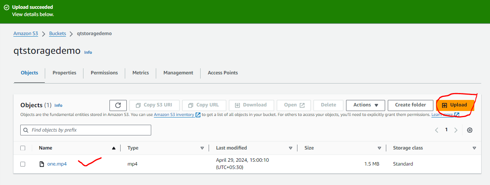
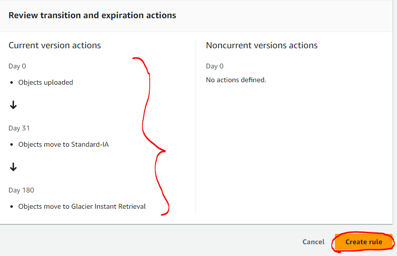

#### AWS Storage Popular Customers

Example-1 : Drop Box (now they have their own infra)


Example-2 :  Amazon Prime music/videos, Netflix


#### Backup and Archival

* _**Backup**_ is meant for recovering quickly from failures, as they are commonly occuring
* _**Archival**_ is meant for recovering from disasters, even when it takes time


* _**Cloud Storage**_ solutions are very popular and cheaper for both backup and archival solutions

#### Data Engineering

* Every Organization has data, which is used for two purposes :
    * Business Intelligence
    * Machine Learning / AI
* Data in your orgnaization comes from :
    * Databases
    * DataWare houses
    * PDF / WORD / TEXT
    * Images
    * Big Data:
        * Hadoop
        * Spark
* Importing data into cloud in the form of lakes etc.. (_**Cloud Storage infrastructure**_)
* Here we need to understand the cloud storage infra services

#### Object Storage for Streaming / media Solutions

* S3 + Cloudfront (Netflix and Amazon Prime)

#### Block Storage for Virtual Machines

* EBS (_**Elastic Block Storage**_)

#### Units in Storage

* KB vs KiB
* IOPS
* Throughput

#### File Shares (Network Storage)

* EFS (Elastic File Share)
* Fsx

#### Storage Services by AWS


#### Object Storage

* This is kind of storage where we can store any file and object storage, for the users who doesnot have any file system. Access to files in the object storage is done over `http(s)`
* _**S3 (Simple Storage Service)**_ is the object `storage as a service`

#### AWS Simple Storage Service _**(s3)**_

* S3 has buckets. Each Bucket can have folders or objects
* Individual object cannot be greater than 5 TB
* Let's create an S3 bucket

=> Navigate through s3       


=> Create bucket


=> select Bucket type : General purpose => Give bucket name : qtstoragedemo


 => select Object Ownership : ACLs disabled => unselect the Block all public access


=> select the acknowledgement => Bucket Versioning : Disable


=> Encription type : Amazon S3 managed keys (SSE-S3) => Bucket key : Enable => Create bucket


=> select the bucket created to insert any content 


=> Upload : select from the system => Upload



=> copy URL


* The URL is `https://qtstoragedemo.s3.amazonaws.com/one.mp4` 

* Price involved in S3 : AWS charges for using `s3` in two dimensions
    * Storage size
    * Access costs
* To adjust access and storage costs, AWS has access tiers
    * _**Standard**_: accesed frequently
        * Access cost - less
        * Storage cost - high
    * _**Infrequent access**_:
        * Storage cost - less
        * Access cost - high
    * _**Glacier**_
        * Storage cost - very low
        * No access costs
* Now let's understand pricing at high level 

  [ Refer Here : https://calculator.aws/#/ ]

    * Size: 10 TB
        * _**Standard**_:
            * Storage cost ~= 235 $
            * Access 1000 TB ~= 716 $
        * _**Infrequent**_:
            * Storage cost ~= 128 $
            * Access 1000 TB ~= 10,240.00
        * _**Glacier**_:
            * Storage cost ~= 12 $
* Terms
    * _**Durability**_ : This property defines what is the chance of data not getting corrupted
    * _**Availability**_: This property defines how much time in an year (calculated in %) is the data available
* Amazon defines `Durability` and `Availability` on the basis of _**redundancy**_ (copies of the data available)

#### Redundancy
    
* By default AWS creates 3 copies of each object and stores them in 3 zones.
* If we select reduced redundancy, then it stores only in one zone
* Create s3 bucket with `ACLs enabled` and ensure `block all public access` is unselcted


* Upload any object into some folder (music)

=> select qtstoragedemoforaccess => Create folder => Folder name : music => Create folder


Create folder => Folder name : videos => Create folder


=> select music folder => upload : one.mp3 and two.mp3 => Permissions : Grant public- read access = Upload


=> Properties => select Standard => Upload


=> select the file and copy URL => Check ver the browser with the URL


* The URL is `https://qtstoragedemoforaccess.s3.amazonaws.com/music/one.mp3` i.e _**https://(<s3-bucketname).s3.region.amazonaws.com/(<object)**_

=> Try similar for videos upload too


* The URL is `https://qtstoragedemoforaccess.s3.amazonaws.com/videos/two.mp4` i.e _**https://(<s3-bucketname).s3.region.amazonaws.com/(<object)**_

#### Storage Classes

* _**Standard (default)**_ :
  * Frequently accessed
  * high storage cost
  * more redundancy
  * free tier plan (5 GB)
  * most widely used
* _**Infrequent Access**_ :
  * For older data which is not frequently used
  * Storage cost - less
  * access cost - more
  * Redundancy - more
* _**One Zone - IA**_ :
  * less durable and infrequent access
* _**Intelligent Tier**_ : where aws chooses storage class based on usage.

* To change storage class 

=> select the bucket => select object => object actions => Edit storage class => select the storage class => Save changes

[_**Note**_ : It is difficult to do individually for many number of objects from a bucket]

* I want to have the object :
    * for the first 30 days in Standard
    * 31-180 days in Onezone – ia
    * 181-1000 days in Glacier
    * 1001 day delete
* For the above mentioned cases, AWS has _**Storage lifecycle**_

=> select bucket => click on management => Create lifecycle rule


=> Lifecycle rule name : forallcontent => choose rule scope : Apply to all objects in the bucket => select the acknowledgement


=> Lifecycle rule actions : Move current versions of objects in between storage classes => choose storage class transitions : Standard-IA => Days after object creation : 31 => Add transition


=> choose storage class transitions : Glacier Instant Retrieval => Days after object creation : 180 


=> create rule




*  Create a text file and upload to s3 into `docs` (new folder) bucket with public access with some content `hello` and try accessing it 


* Now change the content and upload the file again


* When we upload the file after changing the content, the older content gets overwritten. If you need to preserve the changes and content, enable _**Versioning**_

=> select bucket => click on Properties => Bucket Versioning => select Edit 


=> Enable => Save changes


=> change the content and upload again 


=> show versions


* AWS supports _**Enable**_ and _**Suspend**_ Versioning

#### Static Website Hosting

* S3 uses `https` and it allows to host a static website
* Static website allows :
    * html
    * css
    * javascript
* Let's create a simple webpage with :
    * index.html (home page)
    * error.html (error page)
* Create a bucket with `acl’s enabled` and grant `public-read only`


* Navigate to properties => Static Website Hosting


* We have added some bootstrap content as below :
```
<head>
    <!-- Latest compiled and minified CSS -->
<link rel="stylesheet" href="https://cdn.jsdelivr.net/npm/bootstrap@3.3.7/dist/css/bootstrap.min.css" integrity="sha384-BVYiiSIFeK1dGmJRAkycuHAHRg32OmUcww7on3RYdg4Va+PmSTsz/K68vbdEjh4u" crossorigin="anonymous">

<!-- Optional theme -->
<link rel="stylesheet" href="https://cdn.jsdelivr.net/npm/bootstrap@3.3.7/dist/css/bootstrap-theme.min.css" integrity="sha384-rHyoN1iRsVXV4nD0JutlnGaslCJuC7uwjduW9SVrLvRYooPp2bWYgmgJQIXwl/Sp" crossorigin="anonymous">

<!-- Latest compiled and minified JavaScript -->
<script src="https://cdn.jsdelivr.net/npm/bootstrap@3.3.7/dist/js/bootstrap.min.js" integrity="sha384-Tc5IQib027qvyjSMfHjOMaLkfuWVxZxUPnCJA7l2mCWNIpG9mGCD8wGNIcPD7Txa" crossorigin="anonymous"></script>
</head>
<body>
    <div class="jumbotron text-center">
        <h1>My First Website</h1>
        <p>Resize this responsive page to see the effect!</p>
      </div>

      <div class="container">
        <div class="row">
          <div class="col-sm-4">
            <h3>AWS</h3>
            <p>Lorem ipsum dolor..</p>
          </div>
          <div class="col-sm-4">
            <h3>DevOps</h3>
            <p>Lorem ipsum dolor..</p>
          </div>
          <div class="col-sm-4">
            <h3>Azure</h3>
            <p>Lorem ipsum dolor..</p>
          </div>
        </div>
      </div>
</body>
```


* And added basic javascript as follows :
```
<!DOCTYPE html>
<html lang="en">
<head>
  <title>Bootstrap Example</title>
  <meta charset="utf-8">
  <meta name="viewport" content="width=device-width, initial-scale=1">
  <link rel="stylesheet" href="https://maxcdn.bootstrapcdn.com/bootstrap/3.4.1/css/bootstrap.min.css">
  <script src="https://ajax.googleapis.com/ajax/libs/jquery/3.6.3/jquery.min.js"></script>
  <script src="https://maxcdn.bootstrapcdn.com/bootstrap/3.4.1/js/bootstrap.min.js"></script>
</head>
<body>

<div class="container">
  <h2>Basic Modal Example</h2>
  <!-- Trigger the modal with a button -->
  <button type="button" class="btn btn-info btn-lg" data-toggle="modal" data-target="#myModal">Open Modal</button>

  <!-- Modal -->
  <div class="modal fade" id="myModal" role="dialog">
    <div class="modal-dialog">

      <!-- Modal content-->
      <div class="modal-content">
        <div class="modal-header">
          <button type="button" class="close" data-dismiss="modal">&times;</button>
          <h4 class="modal-title">Modal Header</h4>
        </div>
        <div class="modal-body">
          <p>Some text in the modal.</p>
        </div>
        <div class="modal-footer">
          <button type="button" class="btn btn-default" data-dismiss="modal">Close</button>
        </div>
      </div>

    </div>
  </div>

</div>

</body>
</html>
```
#### CDN ( Content Delivery Networks )

* Let's create an s3 bucket with video files and open them in some web page
* AWS has `edge locations` across the world 

  [ Refer Here : https://www.feitsui.com/en/article/3 ]

* To enable CDN, AWS has a service called as _**Cloud Front**_
* Let's create a distribution


* Replacing the s3 access links for videos to cloudfront names
```
<head></head>

<body>
    <div>
        <video width="320" height="240" controls>
            <source src="https://d2wax5ovdqyzkb.cloudfront.net/one.mp4" type="video/mp4" />
        </video>
        <video width="320" height="240" controls>
            <source src="https://d2wax5ovdqyzkb.cloudfront.net/two.mp4" type="video/mp4" />
        </video>
    </div>
    <div>
        <video width="320" height="240" controls>
            <source src="https://d2wax5ovdqyzkb.cloudfront.net/three.mp4" type="video/mp4" />
        </video>
        <video width="320" height="240" controls>
            <source src="https://d2wax5ovdqyzkb.cloudfront.net/four.mp4" type="video/mp4" />
        </video>
    </div>

</body>
```
* Replication to other regions
    * Mangement -> Replication rules


* Replication rules will create s3 jobs

#### Using CLI

* AWS S3 supports two cli commands
    * s3
    * s3 api (low level operations)
* AWS CLI has the following syntax :

  `aws <service> <action> [--arg1 value1 --argn valuen]`
* Let's work with cloud shell today


* s3 bucket uri : `s3://<bucket-name>`
* s3 object uri : `s3://<bucket-name>/folder-name/object-name` `s3://qttesting/videos/one.mp4` or `s3://qttesting/one.mp4`
* Open aws s3 cli docs :

    [ Refer Here : https://docs.aws.amazon.com/cli/latest/reference/s3/ ]

* ls:


* mb: create the bucket
    * create a s3 bucket


    * In this bucket create two folders
        * music
        * videos
    * In the music upload some files
    * In the videos upload some files
    * Show the contents
        * of all the buckets


        * of music folder
    * Remove the bucket
* To upload a file `aws s3 cp`
* Create a bucket with name which has source in it and one more bucket with name which has destination in it.
* Uplod some files in to source bucket (ensure you have folders) and copy the contents into destination bucket
    * copy one file
    * copy all the bucket
        * use sync
        * use recursive copy
    * `mv` move the object in a bucket from one folder to the other
* Delete all the buckets
* Upload a file into a bucket with public read permissions

#### S3 Bucket Policies

* S3 has a resource based access policy which is referrd as s3 bucket policies
* S3 has support of _**acl (access control list)**_ where we can provide basic access levels such as :
    * private
    * public-read
    * public-write
* We can create s3 bucket policies using policy generator 

  [ Refer Here : https://awspolicygen.s3.amazonaws.com/policygen.html ]

* Let's create a bucket in s3
* Consider the following bucket policy, which gives accces to all objects from a specific ip :
```
{
  "Id": "Policy1681791649818",
  "Version": "2012-10-17",
  "Statement": [
    {
      "Sid": "Stmt1681791641953",
      "Action": "s3:*",
      "Effect": "Allow",
      "Resource": ["arn:aws:s3:::qtaccesspolicy", "arn:aws:s3:::qtaccesspolicy/*"],
      "Condition": {
        "IpAddress": {
          "aws:SourceIp": "49.205.254.230/32"
        }
      },
      "Principal": "*"
    }
  ]
}
```
* Add the policy to S3 bucket


* Upload some text / audio / video file into the bucket. Try accessing the ipaddress which gets access to a file


* For others we get access denied
* Let's change the policy to
```
{
  "Id": "Policy1681791649818",
  "Version": "2012-10-17",
  "Statement": [
    {
      "Sid": "Stmt1681791641953",
      "Action": "s3:*",
      "Effect": "Allow",
      "Resource": ["arn:aws:s3:::qtaccesspolicy", "arn:aws:s3:::qtaccesspolicy/*"],
      "Condition": {
        "NotIpAddress": {
          "aws:SourceIp": "49.205.254.230/32"
        }
      },
      "Principal": "*"
    }
  ]
}
```
* Now if we want to give access to specific aws user `qtdevops`
```
{
  "Id": "Policy1681791649818",
  "Version": "2012-10-17",
  "Statement": [
    {
      "Sid": "Stmt1681791641953",
      "Action": "s3:*",
      "Effect": "Allow",
      "Resource": ["arn:aws:s3:::qtaccesspolicy", "arn:aws:s3:::qtaccesspolicy/*"],      
      "Principal": "arn:aws:iam::678879106782:user/qtdevops"
    }
  ]
}
```
* Now if we want to give access to specific aws user `devops`
```
{
  "Id": "Policy1681791649818",
  "Version": "2012-10-17",
  "Statement": [
    {
      "Sid": "Stmt1681791641953",
      "Action": "s3:*",
      "Effect": "Allow",
      "Resource": ["arn:aws:s3:::qtaccesspolicy", "arn:aws:s3:::qtaccesspolicy/*"],      
      "Principal": "arn:aws:iam::678879106782:group/devops"
    }
  ]
}
```
* _**Exercise**_ : Write a bucket policy to give access to all on your objects in a bucket
```
{
  "Id": "Policy1681791649818",
  "Version": "2012-10-17",
  "Statement": [
    {
      "Sid": "Stmt1681791641953",
      "Action": "s3:*",
      "Effect": "Allow",
      "Resource": ["arn:aws:s3:::qtaccesspolicy", "arn:aws:s3:::qtaccesspolicy/*"],      
      "Principal": "*"
    }
  ]
}
```
#### Overview of Other Storage Types

* _**Virtual Disks**_ : This storage acts a disk to an ec2 instance. To create Virtual Disks we have two options :
    * Elastic Block Storage (EBS)
    * Instance-Store
* _**Network Disks**_ : To create network disks also we have two options :
    * Elastic File Share (EFS)
    * FsX
* _**EBS/Instance-Storage**_ are disk storages which are used to serve one instance at a time, where as _**EFS/FsX**_ are used to serve multiple machines over the network
* _**Disk Technologies**_
    * Magnetic
    * Hard Disk Drives (HDD)
    * Solid State Drives (SSD)
* Important _**factors of Disk**_
    * Size
    * Speed
* _**Performance of the disks**_ are measured using :
    * IOPS
    * Throughput

#### AWS Disk Storages

#### Amazon Elastic Block Storage

* This is a service that offers a persistent storage for ec2 instances
* EBS has to be _**os disk**_ in AWS
* EBS will be from the same zone in a region where ec2 is launched
* EBS is physically located in different server in the same zone where ec2 is launched where as instance store comes from the same physical location
* _**Instance store**_ is supported only by few instance types
* AWS uses a term called as _**Volume**_ to represent disk
* Root volume is disk with os which has to be EBS


* EBS can be attached to only one ec2 instance at any given moment
* Backups of EBS volumes are called as _**Snapshots**_
* Snapshots can be taken manually or AWS Backup service can automatically take backups according to schedules
* _**EBS Volumes types**_
    * _**General Purpose SSD**_ :
        * IOPS : 100 to 16,000 IOPS
        * good performace at low cost
    * _**Provisioned IOPS SSD**_ :
        * IOPS : 100 to 100000 iops
        * Size to IOPS ratio has to be between (1:50)
    * HDD-Backed Volume
    * Throughput Optimized HDD
    * ColdHDD


* AWS can provide :
    * empty disks to EC2
    * disks from snapshots to EC2
* EC2 disk sizes can be increased, but not decreased

#### Amazon Elastic File Share

* Fully managed file share which can be mounted to multiple linux instances
* This is storage from network, so it comes with security group
* _**Performance Mode**_ :
    * General Purpose
    * Max I/O Mode
* EFS cannot be mounted as os disk, where as can be mounted on any other disk

#### Experiments

* Create two ubuntu ec2 instances in any region


* Make a note of Volumes created


* Create a snapshot of volume


* From snapshot create a new volume in different _**AZ ( Availability Zone )**_


* From snapshot create a new volume in different Region
    * Select Snapshot
    * Copy snapshot to any region
    * from there create ebs volume


#### Next Steps

* Create a new empty volume (Size 1 GB)
* Mount this to one ec2 instance
* Create a xfs based file system
* Restart the machine
* See what are mounts attached

#### Tasks

* Create an ec2 instance


* Create a new empty volume (Size 1 GB)


* Attach the volume to ec2


* Mount this to ec2 instance


* Create a xfs based file system


* Let's mount this to a folder / tools


* Restart the machine
* See what are mounts attached


* If we need to preserve the mounts we need to deal with _**fstab**_
* Execute `sudo blkid` and make a note of block id info
```
/dev/xvdf: UUID="1b12551c-f61d-4847-bd9d-30fbff96668a" BLOCK_SIZE="512" TYPE="xfs"
```
* Add the following info to `/etc/fstab` 
```
UUID=ed4b67f9-3002-461b-ac30-0bb71e4c3f4c /tools xfs defaults,nofail 1 2
```
* Let's restart the machine and check mounts
* For the instructions :

    [ Refer here : https://learn.microsoft.com/en-us/azure/virtual-machines/linux/attach-disk-portal?tabs=ubuntu#find-the-disk ]


* Lab Setup
    * Ensure you have two linux instances up and running in the same region
    * Try doing the single machine and attaching disks in windows

#### Overview of Disks on Windows and linux


#### Elastic File Share

* This is network file share
* Security group exists for EFS
* EFS is a regional resource, where we mention in which zones we want to have mounts. Sync of data across AZ’s is managed by AWS
* EFS works only with linux instances
* Let's create two ec2 instances in different zones


* Create a efs file share


* Now view details


* Mounting using efs mount helper 

    [ Refer Here : https://docs.aws.amazon.com/efs/latest/ug/efs-mount-helper.html ]

* Installation instructions for linux 

    [ Refer Here : https://docs.aws.amazon.com/efs/latest/ug/mounting-fs-mount-helper-ec2-linux.html ]

* Mount one ec2 instance and create files


#### AWS FsX

* FSx is an AWS Managed service for file shares from third parties
* As of now AWS supports :
    * NetAPP
    * Windows File Share
    * ZFS
    * Lustre


#### Glacier
* For Glacier Data Models

    [ Refer here : https://docs.aws.amazon.com/amazonglacier/latest/dev/amazon-glacier-data-model.html ]

* Create a vault 

    [ Refer Here : https://docs.aws.amazon.com/amazonglacier/latest/dev/creating-vaults-cli.html ]

* For the glacier cli

    [ Refer here : https://docs.aws.amazon.com/cli/latest/reference/glacier/ ]

* Create a vault
```
aws glacier create-vault --acount-id <your-acc-id> --vault-name 'qtvault'
```


* Create a zip file with some content
* Upload the zip file to the vault 

    [ Refer Here : https://docs.aws.amazon.com/amazonglacier/latest/dev/uploading-archive-single-operation.html ]


* If you want to deal with large file by breaking that into multiple parts

    [ Refer here : https://docs.aws.amazon.com/amazonglacier/latest/dev/uploading-an-archive-mpu-using-cli.html ]

* For downloading the archive (during disasters)

    [ Refer here : https://docs.aws.amazon.com/amazonglacier/latest/dev/downloading-an-archive-using-cli.html ]

* To get all the archive ids
```
aws glacier initiate-job --vault-name awsexamplevault --account-id 111122223333 --job-parameters "{\"Type\":\"inventory-retrieval\"}"
```
* Glacier has 3 types :
    * Instant Retrieval (costliest glacier storage cost)
    * Instant Flexible Retrival
    * Deep archive (cheapest glacier storage cost)


#### Exercies

* What is max file size for individual file in S3
* What does eleven 9’s durability means
* What are different storage classes in S3
* How to take backup of EBS volume in an automated and manual fashion
* Explain EBS disk types from slowest to fastest disk
* Max size of Disk in EBS
* What is Max Disk Size in EFS


