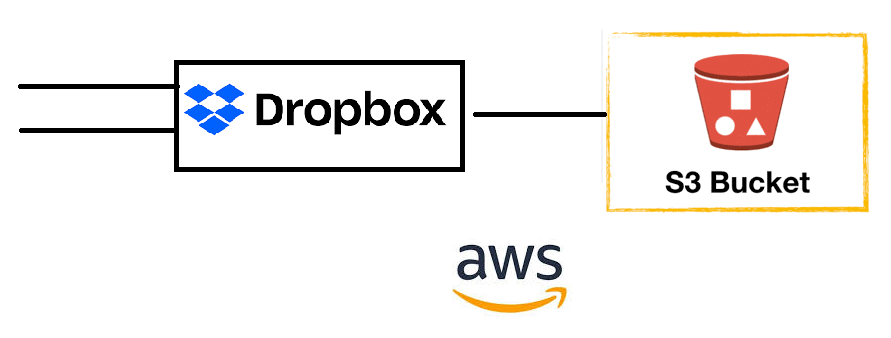
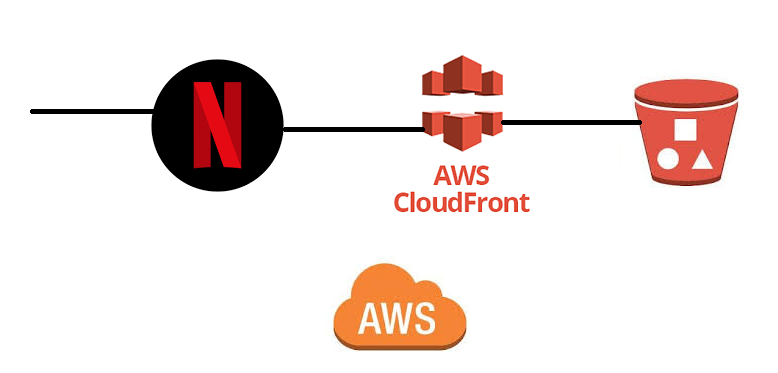
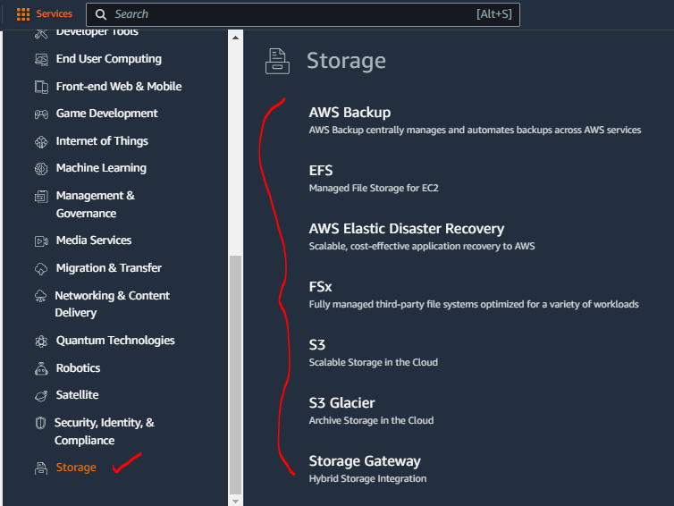

#### AWS Storage Popular Customers

* Example-1 : Drop Box (Now they have their own infra)

* Example-2 :  Amazon Prime music/videos, Netflix

#### Backup and Archival

* _**Backup**_ is meant for recovering quickly from failures
* _**Archival**_ is meant for recovering from disasters

* Cloud Storage solutions are very popular and cheaper for both backup and archival solutions

#### Data Engineering

* Every Organization has data, which is used for two purposes
    * Business Intelligence
    * Machine Learning/AI
* Data in you orgnaization comes from
    * Databases
    * DataWarehouses
    * PDF/WORD/TEXT
    * Images
    * Big Data:
        * Hadoop
        * Spark
* Importing data into cloud in the form of lakes etcs.. (Cloud Storage infrastructure)
* Here we need to understand the cloud storage infra services

#### Object Storage for Streaming/media Solutions

* S3 + Cloudfront (Netflix and Amazon Prime)

#### Block Storage for Virtual Machines

* EBS (Elastic Block Storage)

#### Units in Storage

* KB vs KiB
* IOPS
* Throughput

#### File Shares (Network Storage)

* EFS (Elastic File Share)
* Fsx

#### Storage Services by AWS

