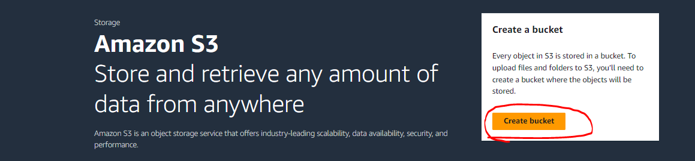
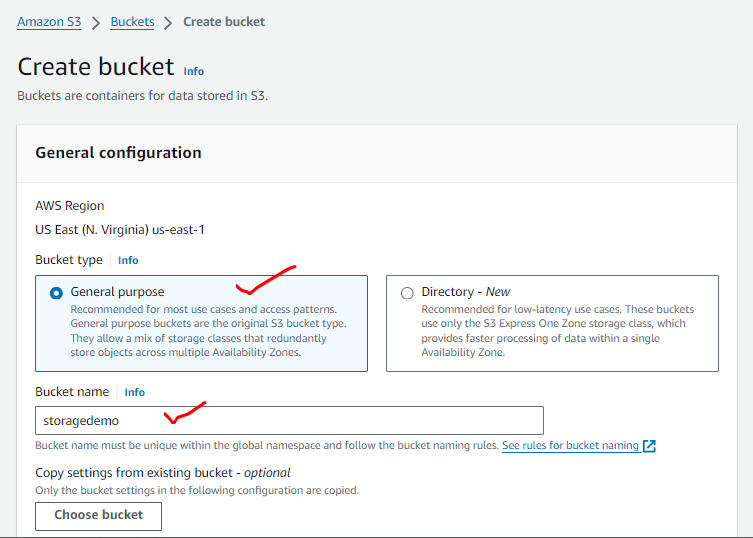
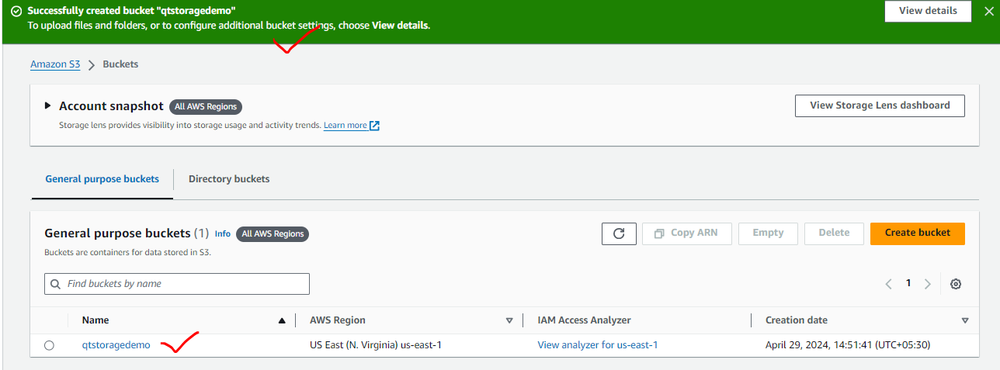
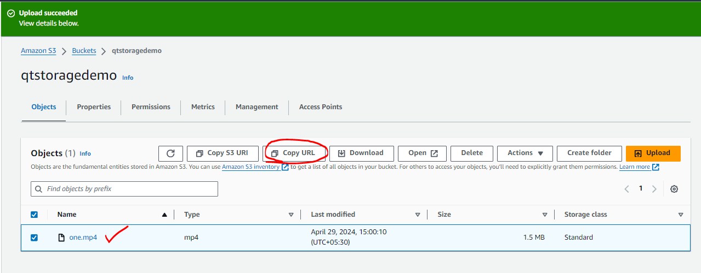

#### AWS Storage Popular Customers

* Example-1 : Drop Box (Now they have their own infra)

* Example-2 :  Amazon Prime music/videos, Netflix

#### Backup and Archival

* _**Backup**_ is meant for recovering quickly from failures
* _**Archival**_ is meant for recovering from disasters

* Cloud Storage solutions are very popular and cheaper for both backup and archival solutions

#### Data Engineering

* Every Organization has data, which is used for two purposes
    * Business Intelligence
    * Machine Learning/AI
* Data in you orgnaization comes from
    * Databases
    * DataWarehouses
    * PDF/WORD/TEXT
    * Images
    * Big Data:
        * Hadoop
        * Spark
* Importing data into cloud in the form of lakes etcs.. (Cloud Storage infrastructure)
* Here we need to understand the cloud storage infra services

#### Object Storage for Streaming/media Solutions

* S3 + Cloudfront (Netflix and Amazon Prime)

#### Block Storage for Virtual Machines

* EBS (Elastic Block Storage)

#### Units in Storage

* KB vs KiB
* IOPS
* Throughput

#### File Shares (Network Storage)

* EFS (Elastic File Share)
* Fsx

#### Storage Services by AWS

#### Object Storage

* This is kind of storage where we can store any file and object storage for the user doesnot have any file system. Access to files in the object storage is done over http(s)
* S3 (Simple Storage Service) is the object storage as a service.

#### AWS Simple Storage Service (s3)

* S3 has buckets. Each Bucket can have folders or objects
* Individual object cannot be greater than 5 TB
* Lets create an S3 bucket

* The url is https://qtstoragedemo.s3.amazonaws.com/one.mp4
* Price involved in S3: AWS charges for using s3 in two dimensions
    * Storage size
    * Access costs
* To adjust access and storage costs, AWS has access tiers
    * Standard: accesed frequently
        * Access cost is less
        * Storage cost is high
    * Infrequent access:
        * Storage cost is less
        * Access cost is high
    * glacier
        * Storage cost is very low
        * No access costs
* Now lets understand pricing at high level Refer Here
    * Size: 10 TB
        * Standard:
            * Storage cost ~= 235 $
            * Access 1000 TB ~= 716 $
        * infrequent:
            * Storage cost ~= 128 $
            * Access 1000 TB ~= 10,240.00
        * glacier:
            * Storage cost ~= 12 $
* Terms
    * Durability: This property defines what is the chance of data not getting corrupted
    * Availability: This property defines how much time in an year (calculated in %) is the data available
* Amazon defines Durability and Availability on the basis for redundancy

